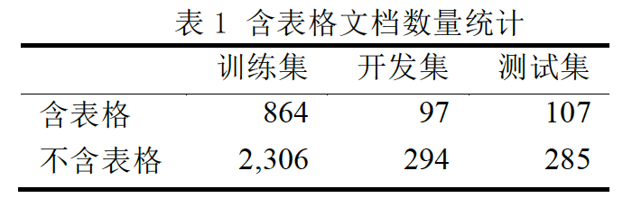
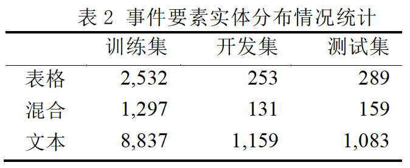
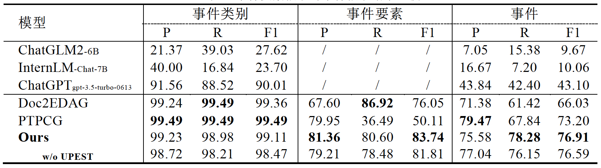

# 《面向含表格文档的中文篇章级事件抽取模型》代码实现

## 📃TableEE数据集

篇章级含表格文档的事件抽取数据集

见data/文件夹下，欢迎使用！👏🏻

## ⚙️配置

### 1. 数据集

将数据集放置于data/文件夹下，命名为TRAIN.json 、DEV.json、TEST.json。

### 2. 安装依赖

`pip install -r requirements.txt`

### 3. 设置config/*.yaml

将BERT等模型所在路径填入train.yaml和test.yaml的'checkpoint'项。

推理时将checkpoint路径填入test.yaml的'output_model_dir'项。

## 🚀运行

切换至仓库根目录下，

训练：'./src/scripts/train.sh'

推理：'./src/scripts/test.sh'

## 💡结果

(ChatGLM2、InternLM、ChatGPT采用ICL)
